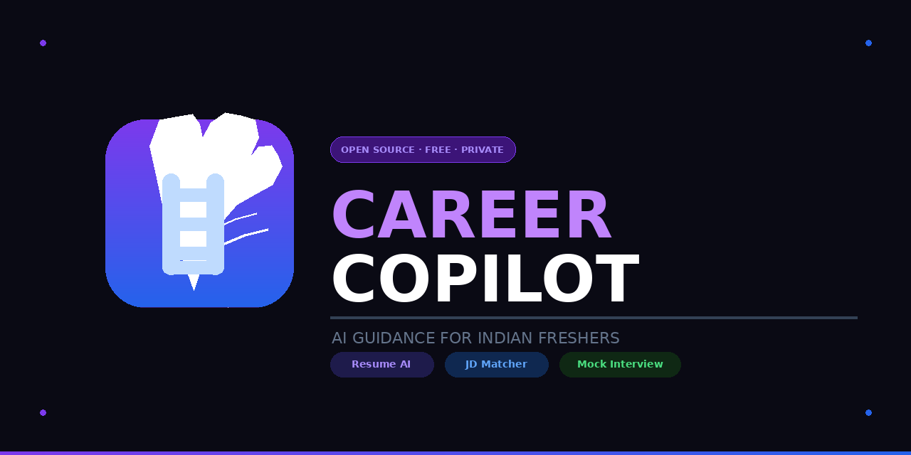

<div align="center">
  
</div>

<br/>
# 🚀 Career Copilot

> AI-powered resume analyzer, JD matcher & mock interview tool — built specifically for Indian freshers.

[](LICENSE)
[](https://github.com/r4huldeveloper/Career-Copilot)
[](CONTRIBUTING.md)

---
## 🎬 Demo

[](https://www.loom.com/share/d04888ab5240409cbb4ad51d5df4048c)

## ✨ Features

- **📄 Resume Analyzer** — ATS score, strengths/weaknesses, rewritten bullets in PM/BA language
- **🎯 JD Matcher** — Paste any JD → exact gaps, missing keywords & ready-to-use resume lines
- **🎤 Mock Interview** — Real questions, write your answer, detailed AI feedback + full expected answer
- **📁 PDF/DOC Upload** — Upload resume directly — no copy-paste needed
- **🔒 100% Private** — Data never leaves your browser. No server, no tracking.
- **🆓 Forever Free** — Uses your own free Groq API key (2 min setup)

---

## 🚀 Run Locally

### Prerequisites
- Free Groq API key → [console.groq.com](https://console.groq.com)
- VS Code + [Live Server extension](https://marketplace.visualstudio.com/items?itemName=ritwickdey.LiveServer)

### Steps

```bash
git clone https://github.com/r4huldeveloper/Career-Copilot.git
cd Career-Copilot
code .
```

Then: right click `index.html` → **Open with Live Server**

> ⚠️ Always open via Live Server (`http://`), never by double-clicking (`file://`).

### Get Your Free Groq API Key
1. Go to [console.groq.com](https://console.groq.com)
2. Sign up free → **API Keys** → **Create API Key**
3. Paste in the app when prompted

---

## 📁 Project Structure

```
Career-Copilot/
├── .github/              # PR templates & GitHub configs
├── assets/               # Demo videos and media
├── src/
│   ├── app.js            # Main orchestrator
│   ├── api/
│   │   └── groq.js       # All AI API calls
│   ├── components/
│   │   ├── fileUpload.js # Drag & drop upload
│   │   ├── modal.js      # Modal controller
│   │   └── progressBar.js # Progress animations
│   ├── styles/
│   │   ├── variables.css # Design tokens
│   │   ├── base.css      # Reset + globals
│   │   ├── components.css # UI components
│   │   └── layout.css    # Page structure
│   └── utils/
│       ├── pdfParser.js  # PDF.js extraction
│       ├── markdown.js   # Markdown -> HTML
│       └── storage.js    # LocalStorage wrapper
├── CONTRIBUTING.md       # Contribution guidelines
├── LICENSE               # Project license
├── README.md             # Project overview
├── ROADMAP.md            # Future features & PDF plans
├── favicon.svg           # Browser icon
├── index.html            # Entry point - markup only
├── logo.svg              # Project branding
└── .gitignore            # Files to ignore in Git
```

---

## 🛠️ Tech Stack

| Technology | Purpose |
|-----------|---------|
| Vanilla JS (ES Modules) | No framework overhead |
| CSS Custom Properties | Design token system |
| PDF.js | PDF text extraction |
| Groq API + Llama 3.3 70B | AI inference (~2s) |

---

## 🤝 Contributing

Contributions welcome! See [CONTRIBUTING.md](CONTRIBUTING.md).

**Good first issues:**
- [ ] Add dark mode
- [ ] Add Gemini API support  
- [x] Save interview history locally
- [x] Improve mobile layout

---

## 📜 License

[MIT](LICENSE) — free to use, modify, distribute.

---

## 👨‍💻 Author

Built by **Rahul Sharma** — built the tool he wished existed when job hunting.

- GitHub: [@r4huldeveloper](https://github.com/r4huldeveloper)
- LinkedIn: [@Rahul Sharma](https://linkedin.com/in/ra4hul)

---

⭐ If this helped you — star the repo. Helps other Indian freshers find it.
