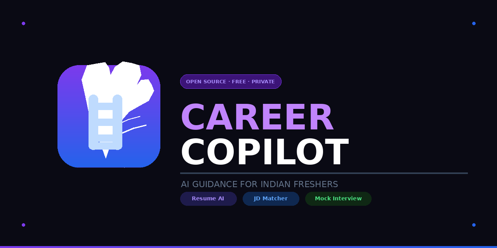

<div align="center">
  
</div>

<br/>

<div align="center">

# 🚀 Career Copilot

**AI-powered resume analyzer, JD matcher & mock interview — built specifically for Indian freshers.**

[](LICENSE)
[](https://github.com/r4huldeveloper/Career-Copilot)
[](CONTRIBUTING.md)
[](CHANGELOG.md)
[](https://github.com/r4huldeveloper/Career-Copilot)

</div>

---

## 🎬 Demo

[](https://www.loom.com/share/d04888ab5240409cbb4ad51d5df4048c)

---

## ✨ Features

| Feature | What it does |
|---|---|
| 📄 **Resume Analyzer** | ATS score, top 3 strengths/weaknesses, rewritten bullets in role-specific language |
| 🎯 **AI Role Fit Analyzer** | Auto-runs after resume analysis — maps your resume to top 5 best-fit roles with gap analysis |
| 🎯 **JD Matcher** | Paste any JD → exact keyword gaps, match score, copy-paste ready resume rewrites |
| 🎤 **Mock Interview** | Real questions by role + type, write your answer, detailed AI feedback + expected answer structure |
| 📊 **Score Tracker** | ATS score history — track if your resume is improving over time |
| 📜 **Interview History** | All past mock sessions saved locally — review anytime |
| 📁 **Resume Upload** | PDF/TXT recommended; DOC/DOCX support is best-effort |
| 🔒 **Privacy-Conscious** | Resume content goes directly to your selected AI provider; preferences and history stay in your browser |
| 🆓 **Forever Free** | Uses your own Groq or Mistral API key (2 min setup) |

---

## 🏗️ Architecture Overview

Career Copilot follows a strict **4-layer architecture**. Every layer has exactly one responsibility — nothing bleeds into another.

```
┌──────────────────────────────────────────────────────────────┐
│                        UI Shell Layer                        │
│   index.html  ·  src/styles/*  ·  src/components/*           │
│   src/app.js  (events + DOM only — zero business logic)      │
└───────────────────────────┬──────────────────────────────────┘
                            │ calls with plain data
┌───────────────────────────▼──────────────────────────────────┐
│                    Pure Logic Layer                          │
│   src/core/logic/resumeLogic.js    — Resume + Role Fit       │
│   src/core/logic/jdLogic.js        — JD Matcher              │
│   src/core/logic/interviewLogic.js — Interview flows         │
│   src/core/logic/sessionState.js   — Runtime state           │
│                                                              │
│   Zero DOM · Zero CSS · Plain data in → plain data out       │
│   Portable to React Native / Electron / Node with 0 rewrites │
└──────────┬────────────────────────────┬──────────────────────┘
           │ calls                      │ reads/writes
┌──────────▼────────────┐   ┌───────────▼──────────────────────┐
│   AI Provider Layer   │   │       Data / Utils Layer         │
│   src/adapters/       │   │   src/utils/storage.js           │
│     aiProvider.js     │   │   src/utils/sanitize.js          │
│   src/api/groq.js     │   │   src/utils/markdown.js          │
│   src/prompts/        │   │   src/utils/pdfParser.js         │
│     groqPrompts.js    │   └──────────────────────────────────┘
└───────────────────────┘
```

**Full architecture docs** → [`.docs/architecture.md`](.docs/architecture.md)
**AI coding rules** → [`.docs/AI_RULES.md`](.docs/AI_RULES.md)

---

## 🔄 Request Flow

```
User clicks button
      │
      ▼
app.js  ──── reads DOM inputs
      │
      ▼
sanitize.js  ──── cleans + clamps all input text
      │
      ▼
Pure Logic Layer  ──── validates → calls GroqAdapter
      │
      ▼
groq.js  ──── circuit breaker → Groq API → structured response
      │
      ▼
Pure Logic Layer  ──── parses output → saves to storage/sessionState
      │
      ▼
app.js  ──── parseMarkdown → renders result in DOM
```

---

## 🚀 Run Locally

### Prerequisites
- Free Groq API key → [console.groq.com](https://console.groq.com)
- VS Code + [Live Server extension](https://marketplace.visualstudio.com/items?itemName=ritwickdey.LiveServer)

### Steps

```bash
git clone https://github.com/r4huldeveloper/Career-Copilot.git
cd Career-Copilot
code .
```

Then: right-click `index.html` → **Open with Live Server**

> ⚠️ Always open via Live Server (`http://`), never by double-clicking (`file://`). ES modules require an HTTP server.

### Get Your Free Groq API Key
1. Go to [console.groq.com](https://console.groq.com)
2. Sign up free → **API Keys** → **Create API Key**
3. Paste in the app when prompted — stored only in your browser, never sent anywhere

---

## 🛠️ Tech Stack

| Technology | Purpose |
|---|---|
| Vanilla JS (ES Modules) | No framework overhead, no build step, instant local dev |
| CSS Custom Properties | Full design token system, dark mode support |
| PDF.js (CDN) | Client-side PDF text extraction |
| Groq API + GPT OSS 120B | AI inference (~2s response time) |
| Vercel | Zero-config static deployment |
| Cloudflare Workers + D1 | Anonymous global stats counter — free tier, zero PII, never pauses |

---

## 🔒 Security & Privacy Model

- **BYOK (Bring Your Own Key):** Your Groq or Mistral API key is stored in your browser's localStorage, Base64-encoded, and sent directly to the selected provider for analysis.
- **Sanitization Gate:** All user inputs pass through `src/utils/sanitize.js` before any processing. All AI output is HTML-escaped before rendering.
- **Anonymous product stats:** The Cloudflare Worker stores tool, role, model, and timestamp for aggregate activity. Resume text and API keys are not stored in its database. Cloudflare may process IP addresses briefly for rate limiting.
- **Browser storage:** API settings, score history, and interview history are saved locally so they remain available on the same browser.
- **Circuit Breaker:** If an AI provider fails 5 times in 60s, requests to that provider are blocked for 15s.

---

## 💡 Why This Architecture (Developer Notes)

- **Zero build step** — clone and run with Live Server. No webpack, no bundler, no `npm install`.
- **Pure Logic Layer** (`src/core/logic/`) is completely decoupled from the DOM. Move to React Native tomorrow — the business logic migrates with zero rewrites.
- **1-file provider swap** — want to add OpenAI or Gemini? Rewrite only `src/adapters/aiProvider.js`.
- **Structured prompt contracts** — every AI prompt defines exact output format. Parsers and prompts are a coupled contract documented in `architecture.md`.
- **AI_RULES.md** governs every change — human or AI agent. No tight coupling, no visual breakage, no unstructured AI output ever gets merged.

---

## 🤝 Contributing

Contributions welcome! Read [CONTRIBUTING.md](CONTRIBUTING.md) first — every PR must pass the Zero-Escape 5-point audit.


## 📜 License

[AGPLv3](LICENSE) — This project is licensed under the AGPL v3.0. We welcome contributions! However, please note that the Career Copilot brand and UI design are proprietary. If you wish to use this software for commercial purposes without the restrictions of the AGPL, please contact us for a commercial license.

---

## 👨‍💻 Author

Built by **Rahul Sharma** — built the tool he wished existed when job hunting.

[](https://github.com/r4huldeveloper)
[](https://linkedin.com/in/ra4hul)

---

<div align="center">

⭐ **If this helped you land a job — star the repo. Helps other Indian freshers find it.**

</div>
