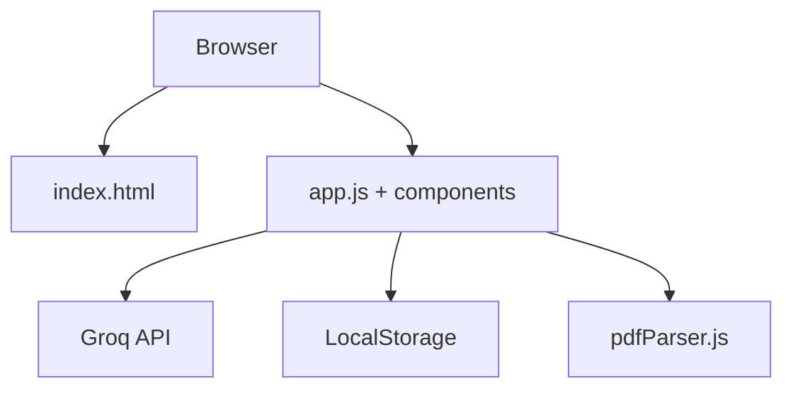
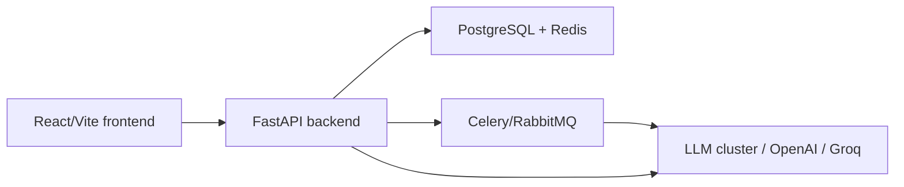

# Career Copilot Architecture

## 1. Overview

### Goal & users
- Goal: AI-driven career assistant for Indian freshers and early-career PM/BA candidates.
- Users: students, recent grads, bootcamp learners, entry-level PM/BA aspirants, campus hires.

### Key features
- Resume analyzer: ATS score, strengths/weaknesses, bullet rewrites.
- JD matcher: keyword balancing, gap analysis, ready-to-paste resume lines.
- Mock interview: question generation, answer evaluation, detailed feedback.
- PDF/DOC upload with client-side text extraction.
- 100% client-side privacy; no server-managed personal data.

## 2. Current State

### Tech stack
- Frontend: plain HTML + vanilla JS (ES modules), CSS variables and components.
- AI integration: direct browser calls to Groq API via `src/api/groq.js`.
- Storage: LocalStorage via `src/utils/storage.js`.
- No dedicated backend or database.

### Folder structure (tree format)
```
Career-Copilot/
├── assets/                        # images, icons, logos, favicons, etc.
├── docs/
│   └── architecture.md            # large-scale architecture documentation
├── src/
│   ├── app.js                     # main orchestrator: wires events, delegates to components
│   ├── config.js                  # ALL constants & configuration (no hardcoding elsewhere)
│   ├── api/
│   │   └── groq.js                # Groq API calls + elite prompts + sessionStorage caching
│   ├── components/
│   │   ├── feedback.js            # feedback widget (Web3Forms integration + rate limiting)
│   │   ├── fileUpload.js          # drag & drop file upload handler
│   │   ├── historyList.js         # renders interview/question history
│   │   ├── modal.js               # generic modal controller
│   │   ├── progressBar.js         # loading / progress animations
│   │   └── scoreTracker.js        # ATS score display & tracking renderer
│   ├── styles/
│   │   ├── variables.css          # design tokens, colors, spacing, typography
│   │   ├── base.css               # CSS reset + global styles
│   │   ├── components.css         # component-specific styles + utility classes
│   │   └── layout.css             # page layout, grid/flex, responsive breakpoints
│   └── utils/
│       ├── markdown.js            # markdown → HTML conversion + XSS escaping
│       ├── pdfParser.js           # PDF text extraction (uses pdf.js lazy-loaded)
│       └── storage.js             # localStorage / sessionStorage wrapper (theme, API key, history, scores)
├── index.html                     # main entry point – markup only, zero logic, zero inline styles
├── README.md                      # project overview, setup, usage
├── ROADMAP.md                     # feature roadmap & future plans
├── CONTRIBUTING.md                # contribution guidelines
├── LICENSE                        # license file (likely MIT or similar)
├── vercel.json                    # Vercel config + CSP headers + security settings
├── .gitignore                     # git ignore rules
└── src/tests.js                   # browser console test suite (edge cases)
```

### Data flow
1. Browser loads `index.html` and JS modules.
2. User configures Groq API key (LocalStorage persistence).
3. User uploads/pastes resume and JD text.
4. `app.js` calls Groq via `api/groq.js` with prompt templates.
5. AI response parsed and rendered in UI.
6. Optional session history saved locally.

### Scale limitations now
- Per-user Groq key reliant; no centralized billing controls.
- No backend auth, RBAC, or long-lived profile tracking.
- XSS/LocalStorage secrets risk with browser-only storage.
- No caching or rate limiting implemented.
- Async and bulk analysis unsupported (single-user flow only).

## 3. Large-Scale Roadmap (1M+ users target)

### Frontend upgrades (React/Vite etc.)
- Migrate to React + Vite + TypeScript.
- Component-based UX: resume, JD, interview, history.
- Offline and mobile-first responsive UI.
- UI state management (Redux/Zustand).

### Backend (FastAPI + auth/DB)
- Add FastAPI service with endpoints for all core features.
- Auth: JWT / OAuth / email + passwordless.
- Move AI requests to backend to hide API keys and enforce quotas.

### AI integration (local models for parsing/interviews)
- Start with hosted (Groq/OpenAI), plan local model runtime (LLM.cpp, Ollama, Anthropic on-prem).
- Modular model selection by task (resume, JD, interview feedback).
- Prompt template and version control.

### Scaling infrastructure
- Caching: Redis for prompt responses and user session data.
- Queue: Celery + RabbitMQ or Redis Queue for async/long jobs.
- Deployment: frontend on Vercel; backend/worker on Railway/Render ? EKS/GKE for high scale.

### Security
- OWASP Top 10 controls: XSS, CSRF, injection, auth flaws.
- Input sanitization and output encoding.
- Rate limiting and token buckets (API + UI).
- Secure headers: CSP, HSTS, SameSite, etc.

### DB schema ideas
- users(id, email, hashed_password, role, created_at, updated_at)
- resumes(id, user_id, source, text_hash, created_at)
- job_descriptions(id, user_id, title, content, created_at)
- analyses(id, user_id, resume_id, jd_id, type, score, results_json, created_at)
- interviews(id, user_id, question, answer, score, feedback, created_at)

### Future capabilities
- Public API for third-party integrations.
- User dashboard (progress, streaks, badges, applied jobs).
- Team/campus account and admin controls.
- A/B testing prompt variants and scoring.

## 4. Diagram

### Current architecture (simplified)


### Proposed 1M+ architecture

